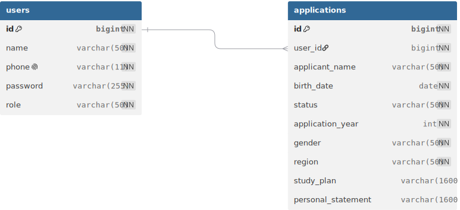

# Database 설계

## ERD

## Auth

### users

| 컬럼명 | 타입 | 제약 조건 | 설명 |
| --- | --- | --- | --- |
| id | BIGINT | PK, AUTO_INCREMENT, NOT NULL | 사용자 ID |
| name | VARCHAR(50) | NOT NULL | 사용자 이름 |
| phone | VARCHAR(11) | NOT NULL, UNIQUE | 전화번호 |
| password | VARCHAR(255) | NOT NULL | 암호화된 비밀번호 |
| role | VARCHAR(50) | NOT NULL | 사용자 권한 |

---

## Application

### applications

| 컬럼명 | 타입 | 제약 조건 | 설명 |
| --- | --- | --- | --- |
| id | BIGINT | PK, AUTO_INCREMENT, NOT NULL | 지원서 ID |
| user_id | BIGINT | FK, NOT NULL | 사용자 ID |
| applicant_name | VARCHAR(50) | NOT NULL | 지원자 이름 |
| birth_date | DATE | NOT NULL | 생년월일 |
| status | VARCHAR(50) | NOT NULL | 지원서 상태 |
| application_year | INT | NOT NULL | 지원 연도 |
| gender | VARCHAR(50) | NOT NULL | 성별 |
| region | VARCHAR(50) | NOT NULL | 지역 |
| study_plan | VARCHAR(1600) | NULL | 학업계획서 |
| personal_statement | VARCHAR(1600) | NULL | 자기소개서 |

---

## 관계

User 1 : N Application

---

## 제약 조건

- users.phone은 중복될 수 없다.
- applications.user_id는 users.id를 참조하는 외래키이다.
- applications 테이블은 (user_id, application_year)에 복합 UNIQUE 제약 조건을 가진다.
- 따라서 한 사용자는 같은 연도에 지원서를 하나만 작성할 수 있다.